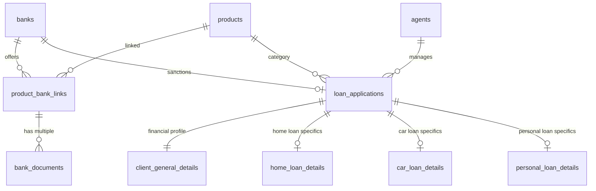

# DSA Loan Platform — Database Schema

## 1. Product Table

**Table:** `products`

| Field | Type | Notes |
|---|---|---|
| id | serial (PK) | Auto-increment primary key |
| name | varchar(255) | Required (e.g. Home Loan, Car Loan, Personal Loan) |
| description | text | Required product summary |
| image | varchar(1024) | Optional / stored in `dsa-file-storage/product-images` |
| is_active | boolean | Default `true` |

---

## 2. Bank Table

**Table:** `banks`

| Field | Type | Notes |
|---|---|---|
| id | serial (PK) | Auto-increment primary key |
| name | varchar(255) | Required (e.g. State Bank of India, HDFC Bank) |
| is_nationalize | boolean | Default `false` |
| is_private | boolean | Default `false` |
| is_nbfc | boolean | Default `false` |
| logo | varchar(1024) | Optional / stored in `dsa-file-storage/bank-logo-images` |
| is_active | boolean | Default `true` |

---

## 3. Agent Table

**Table:** `agents`

| Field | Type | Notes |
|---|---|---|
| id | serial (PK) | Auto-increment primary key |
| name | varchar(255) | Required |
| email | varchar(255) | Unique, required |
| mobile | varchar(32) | Required |
| temp_password | varchar(255) | Optional initial password |
| password | varchar(255) | Hashed password |
| temp_password_reset | boolean | Default `false` |
| is_admin | boolean | Default `false` |
| photo | varchar(1024) | Optional / stored in `dsa-file-storage/agent-photos` |
| is_active | boolean | Default `true` |

---

## 4. Product-Bank Link Table

**Table:** `product_bank_links`

Links a Product with a Bank and sets DSA payout commission rate.

| Field | Type | Notes |
|---|---|---|
| id | serial (PK) | Auto-increment primary key |
| bank_id | integer (FK) | References `banks(id)` ON DELETE CASCADE |
| product_id | integer (FK) | References `products(id)` ON DELETE CASCADE |
| commission | numeric(10,2) | DSA Commission % (e.g. 1.50) |
| is_active | boolean | Default `true` |

---

## 5. Bank Document Table (Multi-Document Support)

**Table:** `bank_documents`

Allows attaching multiple scheme/guideline documents per bank-product offering (e.g. SBI Home Loan can have "Policy Guidelines", "ROI Rate Sheet", "KYC Checklist", etc.).

| Field | Type | Notes |
|---|---|---|
| id | serial (PK) | Auto-increment primary key |
| product_bank_link_id | integer (FK) | References `product_bank_links(id)` ON DELETE CASCADE |
| document_name | varchar(255) | Display title (e.g. "Interest Rate Matrix 2026") |
| document_location | varchar(1024) | File path in `dsa-file-storage/bank-documents` |
| created_at | timestamp | Default `CURRENT_TIMESTAMP` |

---

## 6. Client General Detail Table

**Table:** `client_general_details`

Captures the applicant's personal and financial profile from the multi-step form.

| Field | Type | Notes |
|---|---|---|
| id | serial (PK) | Auto-increment primary key |
| name | varchar(255) | Applicant full name |
| age | integer | Applicant age |
| gender | varchar(32) | `Male`, `Female`, `Other` |
| location | varchar(255) | City / Residential location |
| employment_type | varchar(64) | `Salaried`, `Self-Employed`, `Business`, etc. |
| is_salaried | boolean | Default `true` |
| monthly_income | numeric(12,2) | Gross monthly salary or business income |
| monthly_obligation | numeric(12,2) | Total monthly fixed living/debt obligations |
| existing_emi | numeric(12,2) | Ongoing EMI payments |
| cibil_score | integer | Credit score (e.g. 750) |
| loan_amount_required | numeric(12,2) | Target loan principal amount |
| preferred_tenure | integer | Preferred duration in years/months |

---

## 7. Home Loan Detail Table

**Table:** `home_loan_details`

| Field | Type | Notes |
|---|---|---|
| id | serial (PK) | Auto-increment primary key |
| property_value | numeric(12,2) | Estimated total property valuation |
| down_payment | numeric(12,2) | Self-financed down payment amount |
| property_location | varchar(255) | City / State / Pincode of property |
| propertyUsageType | varchar(64) | `residential`, `commercial`, `semi-commercial` |
| propertyRequirement | varchar(64) | `Purchase`, `Construction`, `Plot + Construction`, `Renovation`, `Balance Transfer` |
| propertyType | varchar(64) | `Apartment`, `Independent House`, `Villa`, `Plot` |
| propertyStatus | varchar(64) | `Ready to Move`, `Under Construction`, `Resale`, `Self Construction` |
| isPartProperty | boolean | Part of larger property development |
| femaleCoApplicant | boolean | Female co-applicant for stamp duty & ROI concessions |
| propertyInsurance | boolean | Property insurance opted |
| applicantInsurance | boolean | Loan protection/term insurance opted |

---

## 8. Car Loan Detail Table

**Table:** `car_loan_details`

| Field | Type | Notes |
|---|---|---|
| id | serial (PK) | Auto-increment primary key |
| new_or_used | varchar(32) | `new` or `used` |
| car_value | numeric(12,2) | Vehicle on-road price / invoice value |
| down_payment | numeric(12,2) | Initial down payment |
| vehicle_age | integer | Age in years (if pre-owned) |

---

## 9. Personal Loan Detail Table

**Table:** `personal_loan_details`

| Field | Type | Notes |
|---|---|---|
| id | serial (PK) | Auto-increment primary key |
| loan_purpose | varchar(128) | `Medical`, `Education`, `Marriage`, `Travel`, `Home Renovation`, `Debt Consolidation`, `Business`, `Other` |
| other | varchar(255) | Description if purpose is `Other` |
| required_amount | numeric(12,2) | Desired loan amount |
| existing_obligations | numeric(12,2) | Current EMI & credit obligations |

---

## 10. Loan Application Table

**Table:** `loan_applications`

The core loan application entity connecting customer, assigned agent, selected product, and loan detail entities.

| Field | Type | Notes |
|---|---|---|
| id | serial (PK) | Auto-increment primary key |
| customer_name | varchar(255) | Full name of applicant |
| customer_email | varchar(255) | Email address |
| customer_mobile | varchar(32) | Mobile number (used for OTP customer login) |
| product_id | integer (FK) | References `products(id)` |
| agent_id | integer (FK) | References `agents(id)` (Assigned DSA Loan Officer) |
| status | varchar(32) | `null` (Pending Review), `approved`, or `rejected`. **Irreversible once decided.** |
| sanctioned_bank_id | integer (FK) | References `banks(id)` (Sanctioning partner bank) |
| sanctioned_remarks | text | Agent approval notes / Sanction terms |
| rejection_reason | text | Agent rejection rationale |
| client_general_details_id | integer (FK) | References `client_general_details(id)` |
| home_loan_details_id | integer (FK) | References `home_loan_details(id)` |
| car_loan_details_id | integer (FK) | References `car_loan_details(id)` |
| personal_loan_details_id | integer (FK) | References `personal_loan_details(id)` |
| created_at | timestamp | Default `CURRENT_TIMESTAMP` |
| updated_at | timestamp | Default `CURRENT_TIMESTAMP` |

---

## 11. Contact Enquiry Table

**Table:** `contact_enquiries`

| Field | Type | Notes |
|---|---|---|
| id | serial (PK) | Auto-increment primary key |
| name | varchar(255) | Lead full name |
| email | varchar(255) | Lead email address |
| mobile | varchar(32) | Lead contact mobile |
| loan_type | varchar(64) | Selected interest category |
| message | text | Enquiry message / requirements |
| created_at | timestamp | Default `CURRENT_TIMESTAMP` |

---

## 12. Main Entity Relationships

