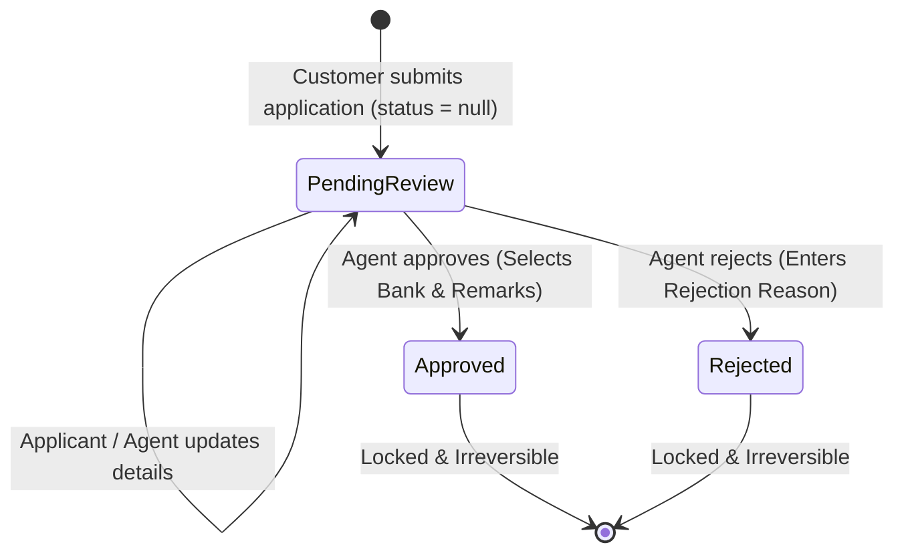

# DSA Loan Platform — Project Overview

## 1. Project Overview

A comprehensive FinTech platform for a Direct Selling Agent (DSA) loan distribution business. The platform connects loan seekers (Customers) with financial institutions (Banks & NBFCs) through specialized loan agents and administrators.

- **Phase 1 (Current)**: Complete deterministic FinTech loan origination platform, multi-bank management, DSA commission configuration, document management, multi-step application journey, agent review workflows, and customer self-service portal.
- **Phase 2 (Future)**: Intelligent assistance with **RAG (Retrieval-Augmented Generation)** across bank policy documents, **MCP tools**, and conversational AI for automated loan eligibility and comparison.

---

## 2. User Roles

1. **Administrator (Admin)**: Full operational control over products, lending partners, partner schemes/documents, agents, customer applications, and payout commission rates.
2. **DSA Loan Agent**: Operational officer responsible for reviewing assigned customer loan applications, evaluating eligibility, executing one-time decisions (Approve with Sanctioning Bank / Reject with Reason), and editing applications when necessary.
3. **Customer / Loan Applicant**: Borrows and tracks loan applications, applies via public multi-step form, and manages loan applications via mobile OTP login.

---

## 3. Application Pages & Features

### A. Public Pages
1. **Home Page (`/`)**:
   - Modern hero section with instant call-to-actions.
   - **Product Carousel / Slider**: Interactive showcase of loan offerings (Home Loan, Car Loan, Personal Loan) with key features and "+ Apply Now" redirection.
   - **Our Lending Partners Section**: Highlights top 5 partner banks/NBFCs with classification badges (Nationalized, Private, NBFC) and quick partner count.
   - **"See All Partners"**: Modal and dedicated Partners Directory (`/partners`) showcasing all participating banks, NBFCs, and interest rate highlights.
   - **Customer Enquiry Form**: Direct lead generation with instant validation.
2. **Partners Directory (`/partners`)**:
   - Full grid of lending partners with category filter tabs (*All*, *Nationalized Banks*, *Private Banks*, *NBFC Institutions*), search by bank name, and direct product offerings.
3. **Public Apply Loan (`/apply`)**:
   - Quick Lead Generation (`Name`, `Email`, `Mobile`, `Selected Product`).
   - OTP verification (Demo mode uses static OTP `123456`).
   - Redirects to Customer Portal with pre-filled lead context.

---

### B. Customer Portal (`/customer`)
1. **Customer Login (`/customer/login`)**:
   - Mobile-based login with instant OTP authentication.
2. **Customer Dashboard & Loan List (`/customer/loans`)**:
   - Overview stats (Total applications, Approved, In Review, Rejected).
   - Filter by status and product.
   - **View Application Details**: Full comprehensive modal displaying:
     - 3 Customer Contact fields
     - 11 Personal & Financial profile fields
     - 11/4/4 Product-specific parameters (Home/Car/Personal)
     - Decision status, Sanctioned Bank, Remarks, or Rejection Reason.
     - Direct Advisor contact card with phone link.
   - **Live Inline Edit**: Allows updating customer profile and loan requirements while status is pending (`null`).
3. **Multi-Step Loan Application (`/customer/apply` & `/apply`)**:
   - Step 1: Basic Profile & Employment Info (11 financial parameters).
   - Step 2: Product Specific Requirements (Property details for Home Loan, Car details for Car Loan, Purpose/Amount for Personal Loan).
   - Step 3: Bank preference & submission.

---

### C. Agent Portal (`/agent`)
1. **Agent Login (`/login`)**:
   - Email & password authentication with JWT tokens.
   - First-time login triggers mandatory password reset modal.
2. **Loan Applications Management (`/agent/loan-applications`)**:
   - View assigned loan applications with applicant details, product badge, requested loan amount, and CIBIL score.
   - **Comprehensive View & Edit Modal**:
     - View all 11 financial + 11/4/4 product fields.
     - Edit applicant data if clarification is provided while pending.
   - **One-Time Irreversible Decision**:
     - **Approve Modal**: Select Sanctioning Bank from mapped partners offering this product + enter sanction remarks.
     - **Reject Modal**: Enter structured rejection reason.
     - *Once decided, status cannot be reverted or altered.*

---

### D. Admin Portal (`/admin`)
1. **Admin Dashboard (`/admin/dashboard`)**:
   - High-level loan distribution metrics, volume metrics, and recent activity.
2. **Product Management (`/admin/products`)**:
   - Add, edit, delete, and toggle status of loan products (Home, Car, Personal).
3. **Bank & Document Management (`/admin/banks`)**:
   - Add/Edit banks with classification flags (Nationalized, Private, NBFC) and logo uploader.
   - **Link Products Modal**:
     - Map products offered by the bank.
     - Configure custom DSA payout commission percentage.
     - **Multi-Document Manager**: Attach multiple scheme/policy documents per product (e.g. "Policy Circular 2026.pdf", "ROI Rate Sheet.pdf", "KYC Norms.docx") with custom display titles and individual deletion.
   - **Bank Profile View Modal**:
     - Displays bank credentials, mapped products, commission rates, and all attached document links.
4. **Agent Management (`/admin/agents`)**:
   - Manage staff agents, assign roles (Admin vs Agent), upload agent photos, and reset temporary passwords.
5. **Loan Applications (`/admin/loan-applications`)**:
   - Global view of all applications across all agents and branches with complete detail view and live edit controls.

---

## 4. Application Status Lifecycle

---

## 5. Phase 2: AI & RAG Capabilities

1. **RAG Knowledge Base**:
   - Indexes all `bank_documents` (PDF/DOCX) using embeddings in PostgreSQL (`pgvector`).
   - Retrieves real-time interest rates, LTV norms, FOIR limits, and property eligibility rules.
2. **Agent AI Copilot**:
   - Instant query assistance: *"Which bank offers the best ROI for a self-employed applicant with a 720 CIBIL score for a 75L Home Loan?"*
   - Auto-matches best lender based on customer financial profile.
3. **Customer AI Assistant**:
   - Conversational pre-qualification and step-by-step guidance on loan documentation.
