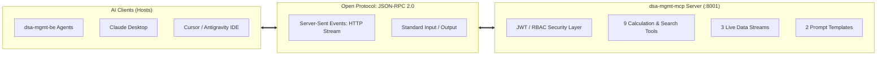
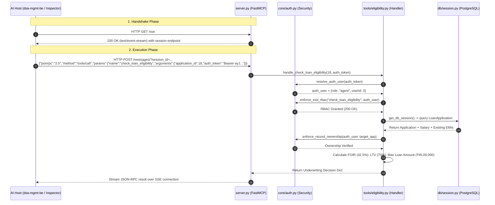

# DSA Loan Management — Model Context Protocol (MCP) Server Architecture & Guide

Welcome to the comprehensive architecture and operational guide for the **DSA Loan Management MCP Server** (`dsa-mgmt-mcp`).

This document provides a detailed breakdown of the MCP concepts, server architecture, end-to-end code flow, client integration steps, and visual inspection using the official **MCP Inspector**.

---

## Table of Contents
1. [Overview & Why MCP?](#1-overview--why-mcp)
2. [Project Structure & Module Organization](#2-project-structure--module-organization)
3. [End-to-End Code Flow](#3-end-to-end-code-flow)
4. [Authentication & Role-Based Access Control (RBAC)](#4-authentication--role-based-access-control-rbac)
5. [Complete Catalog of Tools, Resources & Prompts](#5-complete-catalog-of-tools-resources--prompts)
6. [How to Connect with Clients](#6-how-to-connect-with-clients)
   - [A. Backend Integration (dsa-mgmt-be)](#a-backend-integration-dsa-mgmt-be)
   - [B. Claude Desktop Integration](#b-claude-desktop-integration)
   - [C. Cursor / Antigravity IDE Integration](#c-cursor--antigravity-ide-integration)
   - [D. Standalone Python Script Client](#d-standalone-python-script-client)
7. [Visual Inspection with MCP Inspector (`npx`)](#7-visual-inspection-with-mcp-inspector-npx)
8. [Troubleshooting & FAQ](#8-troubleshooting--faq)

---

## 1. Overview & Why MCP?

### What is Model Context Protocol (MCP)?
**Model Context Protocol (MCP)** is an open industry standard developed by Anthropic that standardizes how AI applications (LLMs, agents, IDEs) discover and interact with external data sources and tools.



### Why a Dedicated MCP Server?
1. **Decoupled Microservice**: Separates AI tools and underwriting math from the main REST API.
2. **Universal Compatibility**: One MCP server simultaneously powers your backend AI sub-agents, local IDE assistants, and external AI tools without rewriting integration code.
3. **Enterprise Security**: Centralizes Role-Based Access Control (RBAC) and data isolation so borrowers, agents, and admins only see authorized data.

---

## 2. Project Structure & Module Organization

`dsa-mgmt-mcp` is structured with clean separation of concerns:

```
dsa-mgmt-mcp/
├── core/                           # Core infrastructure & security
│   ├── __init__.py
│   ├── config.py                   # Central settings, environment variables
│   ├── auth.py                     # JWT validation, role resolution, RBAC rules
│   └── serializer.py               # Loan application data serialization
│
├── db/                             # Database access layer
│   ├── __init__.py
│   └── session.py                  # SQLAlchemy engine & SessionLocal context manager
│
├── rag/                            # Retrieval-Augmented Generation
│   ├── __init__.py
│   └── vector_search.py            # pgvector semantic credit policy search
│
├── tools/                          # Standardized MCP Tools (@mcp.tool)
│   ├── __init__.py
│   ├── eligibility.py              # check_loan_eligibility
│   ├── policy_search.py            # search_bank_policies
│   ├── comparison.py               # compare_bank_offers
│   ├── dossier.py                  # get_loan_dossier
│   ├── catalog.py                  # get_bank_product_catalog
│   ├── directory.py                # get_agent_directory (Admin only)
│   ├── analytics.py                # get_commission_analytics, get_portfolio_kpis
│   └── enquiries.py                # get_contact_enquiries
│
├── resources/                      # Standardized MCP Resources (@mcp.resource)
│   ├── __init__.py
│   ├── bank_catalog.py             # dsa://catalog/banks, dsa://catalog/products
│   └── policy_docs.py              # dsa://policies/{bank_id}
│
├── prompts/                        # Standardized MCP Prompts (@mcp.prompt)
│   ├── __init__.py
│   ├── underwriting.py             # underwriting_review
│   └── rate_comparison.py          # compare_bank_offers
│
├── tests/
│   └── test_mcp_server.py          # Automated unit test suite
│
├── server.py                       # Main FastMCP application entrypoint
├── requirements.txt                # Python dependencies
├── .env                            # Local configuration
├── .env.example                    # Template configuration
├── mcp_config.json                 # Desktop & IDE host configuration
└── README.md                       # Quickstart documentation
```

---

## 3. End-to-End Code Flow

Here is the exact step-by-step journey of an MCP request:



### Explanation of the Steps:
1. **Connection**: Client initiates an HTTP GET request to `/sse`. The server opens a persistent Server-Sent Events stream and assigns a unique `session_id`.
2. **Dispatch**: Client posts a JSON-RPC 2.0 `tools/call` message.
3. **Authentication**: `core/auth.py` decodes the JWT access token and extracts `userId`, `role`, and customer identity.
4. **RBAC Verification**: Ensures the user's role has permission to execute the requested tool.
5. **Data Retrieval & Ownership**: Queries PostgreSQL via `db/session.py` and verifies ownership (borrowers can only view their own loans; agents only view assigned loans).
6. **Execution & Response**: Executes mathematical formulas or vector searches and returns structured JSON to the client.

---

## 4. Authentication & Role-Based Access Control (RBAC)

Every tool execution passes through strict multi-tier security:

```
Unauthenticated / Customer  ──>  Customer Tools (5 tools)
Agent Role                  ──>  Customer Tools + Analytics + Leads (8 tools)
Admin Role                  ──>  Full Platform Access (All 9 tools + Agent Directory)
```

### Permission Matrix:

| MCP Tool Name | Customer / Public | Agent | Platform Admin |
| :--- | :---: | :---: | :---: |
| `search_bank_policies` | ✅ Allowed | ✅ Allowed | ✅ Allowed |
| `check_loan_eligibility` | ✅ (Own loan only) | ✅ (Assigned only) | ✅ Full |
| `compare_bank_offers` | ✅ (No commission shown) | ✅ (With payouts) | ✅ (With payouts) |
| `get_loan_dossier` | ✅ (Own profile only) | ✅ (Assigned only) | ✅ Full |
| `get_bank_product_catalog` | ✅ (No commission shown) | ✅ (With commissions) | ✅ Full |
| `get_commission_analytics` | ❌ Blocked (403) | ✅ (Personal earnings) | ✅ (All team earnings) |
| `get_portfolio_kpis` | ❌ Blocked (403) | ✅ (Personal portfolio) | ✅ (All company portfolio) |
| `get_contact_enquiries` | ❌ Blocked (403) | ✅ Allowed | ✅ Allowed |
| `get_agent_directory` | ❌ Blocked (403) | ❌ Blocked (403) | ✅ Allowed |

---

## 5. Complete Catalog of Tools, Resources & Prompts

### A. The 9 MCP Tools (`@mcp.tool`)
1. **`search_bank_policies(query, bank_id, product_id, top_k)`**:
   * Uses `pgvector` embeddings to search credit policy PDFs (interest rates, prepayment rules, FOIR thresholds, NRI guidelines).
2. **`check_loan_eligibility(application_id)`**:
   * Deterministic underwriting engine calculating FOIR, LTV, disposable income surplus, monthly EMI, and max loan sanction.
3. **`compare_bank_offers(application_id, bank_ids, user_role)`**:
   * Multi-bank quote matrix evaluating interest rates, processing fees, insurance, and DSA commission payouts.
4. **`get_loan_dossier(application_id, customer_id, agent_id, customer_identifier)`**:
   * Unified lookup for loan applications, customer credit history, or agent loan pipelines.
5. **`get_bank_product_catalog(product_id, bank_id)`**:
   * Live catalog of active partner banks, products offered, and payout commission percentages.
6. **`get_agent_directory(agent_id, include_inactive, with_workload_metrics)`**:
   * *Admin Only*: Directory of agents with assigned loan volumes and performance workload metrics.
7. **`get_commission_analytics(agent_id, bank_id, product_id, status)`**:
   * Realized and pipeline DSA commission revenue breakdowns.
8. **`get_portfolio_kpis(product_type, agent_id)`**:
   * High-level pipeline KPIs, active application counts, and status distributions.
9. **`get_contact_enquiries(status, loan_type, limit)`**:
   * Customer leads submitted via the public website contact form.

### B. The 3 Live Resources (`@mcp.resource`)
* **`dsa://catalog/banks`**: Live JSON list of active partner banks and institution categories.
* **`dsa://catalog/products`**: Live JSON list of supported loan products (Home, Car, Personal Loan).
* **`dsa://policies/{bank_id}`**: Indexed document library and uploaded PDF metadata for a specific bank.

### C. The 2 Prompt Templates (`@mcp.prompt`)
* **`underwriting_review(application_id)`**: Standardized credit underwriting review prompt for LLMs.
* **`compare_bank_offers(application_id, bank_names)`**: Multi-bank rate comparison prompt template.

---

## 6. How to Connect with Clients

### A. Backend Integration (`dsa-mgmt-be`)

In `dsa-mgmt-be/.env`:
```properties
MCP_SERVER_URL=http://localhost:8001/sse
MCP_TRANSPORT=sse
```

When backend sub-agents (`LoanMatchingAgent`, `DocumentIntelligenceAgent`, `ApplicationOperationsAgent`) execute tools, they dispatch over the network:

```python
from app.ai.mcp_client import execute_mcp_tool

# Executes over HTTP/SSE to port 8001
result = execute_mcp_tool(
    tool_name="check_loan_eligibility",
    arguments={"application_id": 18},
    auth_user={"role": "agent", "userId": 3},
)
```

---

### B. Claude Desktop Integration

1. Open `%APPDATA%\Claude\claude_desktop_config.json` (Windows) or `~/Library/Application Support/Claude/claude_desktop_config.json` (Mac).
2. Add the server definition:

```json
{
  "mcpServers": {
    "dsa-loan-management": {
      "command": "python",
      "args": [
        "c:/Users/lokeshyadav/Documents/Lokesh/Projects/learning/python-basics/DSA-loan-management/dsa-mgmt-mcp/server.py",
        "--transport",
        "stdio"
      ]
    }
  }
}
```
3. Restart Claude Desktop. A hammer icon will appear in the chat allowing Claude to query your loan database directly.

---

### C. Cursor / Antigravity IDE Integration

1. Open **Settings > Features > MCP Servers** in Cursor or Antigravity.
2. Add a new MCP server:
   * **Name:** `dsa-loan-management`
   * **Type:** `sse`
   * **URL:** `http://localhost:8001/sse`
3. Now Cursor Composer / AI Agent can query live loan data during your development workflows.

---

### D. Standalone Python Script Client

You can connect to the running MCP server from any Python script:

```python
import asyncio
from mcp import ClientSession
from mcp.client.sse import sse_client

async def main():
    async with sse_client("http://localhost:8001/sse") as (read_stream, write_stream):
        async with ClientSession(read_stream, write_stream) as session:
            await session.initialize()
            
            # List all available tools
            tools = await session.list_tools()
            print("Discovered Tools:", [t.name for t in tools.tools])
            
            # Call a tool
            result = await session.call_tool(
                name="get_bank_product_catalog",
                arguments={"product_id": 1}
            )
            print("Result:", result.content[0].text)

asyncio.run(main())
```

---

## 7. Visual Inspection with MCP Inspector (`npx`)

The **MCP Inspector** is the official web UI playground for testing, debugging, and demonstrating MCP tools in a browser.

### Step 1: Start the MCP Server
In Terminal 1:
```powershell
cd dsa-mgmt-mcp
python server.py
```
*(Server starts listening on `http://0.0.0.0:8001`)*.

---

### Step 2: Launch the MCP Inspector
In Terminal 2:
```powershell
npx @modelcontextprotocol/inspector
```

---

### Step 3: Connect to the Server
1. Open the URL shown in the terminal (usually `http://localhost:5173`) in your browser.
2. Configure the connection settings in the top bar:
   * **Transport Type:** Select `SSE`
   * **URL:** Enter `http://localhost:8001/sse`
3. Click **Connect**.

---

### Step 4: Interact with Tools, Resources & Prompts in the Browser
* **Tools Tab**: Select any tool (e.g., `check_loan_eligibility`), type `application_id: 18`, and click **Run Tool** to see the formatted JSON output.
* **Resources Tab**: Click **List Resources** and inspect `dsa://catalog/banks`.
* **Prompts Tab**: Render and review prompt templates.
* **Console / Logs Tab**: View live JSON-RPC traffic.

---

## 8. Troubleshooting & FAQ

### Q1: `ModuleNotFoundError: No module named 'groq'`
* **Cause**: Backend services eager package loading was triggering LLM client dependencies.
* **Solution**: Handled via lazy exports in `dsa-mgmt-be/app/services/__init__.py`. `dsa-mgmt-mcp` does not need the `groq` SDK.

### Q2: Port 8001 already in use
* **Check running process**:
  ```powershell
  Get-NetTCPConnection -LocalPort 8001
  ```
* **Kill the process**:
  ```powershell
  Stop-Process -Id <PID> -Force
  ```

### Q3: Why does `http://localhost:8001/sse` keep spinning in a regular browser tab?
* This is expected behavior for **Server-Sent Events (SSE)**. The browser establishes an open-ended HTTP stream awaiting real-time events. To interact with it visually, use **MCP Inspector** (`npx @modelcontextprotocol/inspector`).
