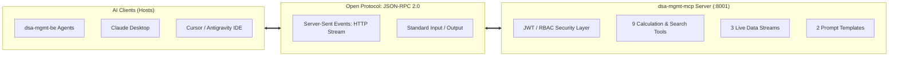

# DSA Loan Management — Model Context Protocol (MCP) Server Architecture & Guide

Welcome to the comprehensive architecture and operational guide for the **DSA Loan Management MCP Server** (`dsa-mgmt-mcp`).

This document provides a detailed breakdown of the MCP concepts, server architecture, end-to-end code flow, client integration steps, and visual inspection using the official **MCP Inspector**.

---

## Table of Contents
1. [Overview & Why MCP?](#1-overview--why-mcp)
2. [Project Structure & Module Organization](#2-project-structure--module-organization)
3. [End-to-End Code Flow](#3-end-to-end-code-flow)
4. [Authentication & Role-Based Access Control (RBAC)](#4-authentication--role-based-access-control-rbac)
5. [Complete Catalog of Tools, Resources & Prompts](#5-complete-catalog-of-tools-resources--prompts)
6. [How to Connect with Clients](#6-how-to-connect-with-clients)
   - [A. Backend Integration (dsa-mgmt-be)](#a-backend-integration-dsa-mgmt-be)
   - [B. Claude Desktop Integration](#b-claude-desktop-integration)
   - [C. Cursor / Antigravity IDE Integration](#c-cursor--antigravity-ide-integration)
   - [D. Standalone Python Script Client](#d-standalone-python-script-client)
7. [Visual Inspection with MCP Inspector (`npx`)](#7-visual-inspection-with-mcp-inspector-npx)
8. [Troubleshooting & FAQ](#8-troubleshooting--faq)

---

## 1. Overview & Why MCP?

### What is Model Context Protocol (MCP)?
**Model Context Protocol (MCP)** is an open industry standard developed by Anthropic that standardizes how AI applications (LLMs, agents, IDEs) discover and interact with external data sources and tools.



### Why a Dedicated MCP Server?
1. **Decoupled Microservice**: Separates AI tools and underwriting math from the main REST API.
2. **Universal Compatibility**: One MCP server simultaneously powers your backend AI sub-agents, local IDE assistants, and external AI tools without rewriting integration code.
3. **Enterprise Security**: Centralizes Role-Based Access Control (RBAC) and data isolation so borrowers, agents, and admins only see authorized data.

---

## 2. Project Structure & Module Organization

The platform uses a shared core package architecture (`dsa-common`) to eliminate code duplication while keeping microservices completely decoupled:

```
DSA-loan-management/
├── dsa-common/                        # 📦 Shared Single Source of Truth
│   ├── pyproject.toml                 # Package definition (pip install -e ../dsa-common)
│   └── dsa_common/
│       ├── constants.py               # Underwriting limits, FOIR/LTV caps, CIBIL tiers
│       ├── models/                    # Single source for all SQLAlchemy ORM models
│       ├── services/                  # Underwriting & multi-bank comparison engines
│       └── repositories/              # Shared data queries, analytics & KPI calculations
│
├── dsa-mgmt-be/                       # 🌐 FastAPI Main Backend Service (:8000)
│   ├── requirements.txt               # Includes -e ../dsa-common
│   └── app/
│       ├── api/                       # REST API endpoints
│       └── ai/                        # AI Chat orchestrator & sub-agents
│
└── dsa-mgmt-mcp/                      # 🤖 Standalone Model Context Protocol Server (:8001)
    ├── requirements.txt               # Includes -e ../dsa-common
    ├── core/                          # Security, JWT auth, RBAC & serializers
    ├── db/                            # DB session context manager
    ├── rag/                           # Embeddings & pgvector semantic policy search
    ├── tools/                         # 8 Production-grade MCP tools
    ├── resources/                     # Live JSON resources (catalog, policy docs)
    ├── prompts/                       # Guided prompt templates
    ├── tests/                         # Automated unit test suite
    ├── server.py                      # FastMCP Application Entrypoint
    └── mcp_config.json                # MCP Host configuration (Claude / Cursor / IDE)
```

---

## 3. End-to-End Code Flow

### 🏛️ General Architectural Lifecycle (Layer-by-Layer Steps)

Whenever an AI Client (Claude Desktop, Cursor, Antigravity, or `dsa-mgmt-be`) invokes an MCP Tool or Resource, the execution passes through these sequential textual steps:

```
Step 1: AI Client Dispatches Request
   └─ Client sends a JSON-RPC 2.0 message over HTTP/SSE:
      {"jsonrpc": "2.0", "method": "tools/call", "params": {"name": "<tool_name>", "arguments": {...}}}

Step 2: SSE Network Transport
   └─ File: server.py
   └─ FastMCP receives the SSE message on port 8001 and parses the requested tool or resource name.

Step 3: Tool Dispatch Layer
   └─ File: tools/<feature>.py (e.g. tools/eligibility.py, tools/policy_search.py, tools/comparison.py)
   └─ Handler function is called with the unpacked JSON arguments and the JWT auth_token.

Step 4: JWT Authentication & Role Resolution
   └─ File: core/auth.py
   └─ Function: resolve_auth_user(auth_token=...)
   └─ Decodes the JWT Bearer token using JWT_SECRET_KEY (HS256) and extracts user role (customer, agent, admin) and userId.

Step 5: Role-Based Access Control (RBAC)
   └─ File: core/auth.py
   └─ Function: enforce_tool_rbac(tool_name, auth_user)
   └─ Checks if the caller's role is permitted to run this tool. If unauthorized, immediately raises MCPAuthError (HTTP 403).

Step 6: Database Session Management
   └─ File: db/session.py
   └─ Function: get_db_session()
   └─ Opens a dedicated, managed PostgreSQL session via SQLAlchemy SessionLocal and passes it to the handler.

Step 7: Data-Level Ownership Verification
   └─ File: core/auth.py
   └─ Function: enforce_record_ownership(auth_user, target_app)
   └─ Verifies that customers only access their own records and agents only access assigned leads.

Step 8: Calculation & Search Engine Execution
   └─ Files: app/services/eligibility/engine.py, app/services/comparison/engine.py, or rag/vector_search.py
   └─ Executes mathematical underwriting logic, multi-bank EMI comparisons, or pgvector cosine similarity search.

Step 9: Data Serialization
   └─ File: core/serializer.py
   └─ Function: serialize_loan_application()
   └─ Serializes ORM model instances and calculated metrics into standard JSON-compatible Python dictionaries.

Step 10: JSON-RPC Streaming Delivery
   └─ File: server.py
   └─ FastMCP packages the result into a standardized JSON-RPC 2.0 response and streams it back to the client over SSE.
```

---

### 🔍 Detailed Step-by-Step Textual Flows by Example

---

### 🔹 Example 1: Credit Underwriting Calculation Tool (`check_loan_eligibility`)

This tool calculates FOIR, LTV, EMI, and maximum eligible loan amount for an applicant.

```
Step 1: AI Client Request
   └─ Client sends JSON-RPC 2.0 over SSE POST:
      - method: "tools/call"
      - params:
          name: "check_loan_eligibility"
          arguments:
             application_id: 18
             auth_token: "Bearer eyJhbGciOiJIUz..."

Step 2: Server Entrypoint & Route Matching
   └─ File: server.py
      └─ FastMCP receives "tools/call" for registered tool "check_loan_eligibility".
      └─ Forwards execution to handle_check_loan_eligibility(application_id=18, auth_token=...).

Step 3: Tool Handler Invocation
   └─ File: tools/eligibility.py
      └─ Function: handle_check_loan_eligibility(application_id, auth_token, auth_context)

Step 4: JWT Token Decoding & Identity Resolution
   └─ File: core/auth.py
      └─ Function: resolve_auth_user(auth_token=auth_token)
      └─ Decodes signed JWT using JWT_SECRET_KEY & JWT_ALGORITHM (HS256).
      └─ Extracts: { "userId": 3, "role": "agent", "name": "Rajesh Kumar", "mobile": "9876543210" }

Step 5: Role-Based Access Control (RBAC) Verification
   └─ File: core/auth.py
      └─ Function: enforce_tool_rbac("check_loan_eligibility", auth_user)
      └─ Verifies that "check_loan_eligibility" is in AGENT_PERMITTED_TOOLS.
      └─ ✅ Access Granted.

Step 6: Database Session & Record Lookup
   └─ File: db/session.py
      └─ Function: get_db_session() opens managed PostgreSQL session.
   └─ File: tools/eligibility.py
      └─ Queries: db.query(LoanApplication).filter(LoanApplication.id == 18).first()
      └─ Loads LoanApplication along with linked clientGeneralDetail, homeLoanDetail, and bank.

Step 7: Record-Level Ownership Authorization
   └─ File: core/auth.py
      └─ Function: enforce_record_ownership(auth_user, target_app=app)
      └─ Checks if the agent (userId=3) is assigned to this loan application (app.agentId == 3).
      └─ ✅ Ownership Verified.

Step 8: Underwriting Engine Execution
   └─ File: dsa-mgmt-be/app/services/eligibility/engine.py
      └─ Function: evaluate_loan_application(db, application_id=18)
      ├─ Reads monthly income: ₹1,50,000, existing obligations: ₹25,000.
      ├─ Calculates Net Disposable Income: ₹1,25,000.
      ├─ Applies Bank FOIR Threshold (55% max debt-to-income):
      │    Max Total EMI = ₹1,50,000 * 0.55 = ₹82,500
      │    Max New EMI = ₹82,500 - ₹25,000 = ₹57,500
      ├─ Calculates Maximum Eligible Loan Amount based on ROI (8.50%) and 20-year tenure:
      │    Max Loan = ₹65,24,000
      ├─ Applies LTV Threshold (80% of Property Value ₹70,00,000 = ₹56,00,000).
      └─ Final Approved Amount: ₹56,00,000 (LTV-constrained).

Step 9: Result Packaging
   └─ File: tools/eligibility.py
      └─ Returns structured dictionary containing FOIR, LTV, EMIs, and positive factors.

Step 10: JSON-RPC Streaming Delivery
   └─ File: server.py
      └─ Wraps result into JSON-RPC 2.0 format:
         {
           "jsonrpc": "2.0",
           "id": 1,
           "result": {
             "content": [
               {
                 "type": "text",
                 "text": "{\"status\":\"APPROVED\",\"maxEligibleAmount\":5600000,\"foirPct\":42.5,...}"
               }
             ]
           }
         }
      └─ Streams back over the persistent SSE connection to the AI Client.
```

---

### 🔹 Example 2: Semantic Bank Policy Vector Search Tool (`search_bank_policies`)

This tool performs RAG semantic vector similarity search over partner bank policy PDFs.

```
Step 1: AI Client Request
   └─ Client sends:
      - method: "tools/call"
      - params:
          name: "search_bank_policies"
          arguments:
             query: "HDFC minimum monthly salary and NRI guarantor rules"
             bank_id: 94
             top_k: 3

Step 2: Server Routing & Dispatch
   └─ File: server.py
      └─ Dispatches to handle_search_bank_policies(query=..., bank_id=94, top_k=3).

Step 3: RBAC Check
   └─ File: core/auth.py
      └─ Function: enforce_tool_rbac("search_bank_policies", auth_user)
      └─ Public/Customer/Agent/Admin all permitted. ✅

Step 4: Vector Search Engine Invocation
   └─ File: rag/vector_search.py
      └─ Function: perform_policy_vector_search(db, query, bank_id=94, top_k=3)

Step 5: Query Vector Embedding
   └─ File: rag/vector_search.py
      └─ Loads SentenceTransformer("all-MiniLM-L6-v2").
      └─ Encodes query text into a 384-dimensional dense vector:
         query_vector = [0.042, -0.128, 0.095, ...]

Step 6: pgvector Cosine Similarity SQL Query
   └─ File: rag/vector_search.py
      └─ Executes raw SQL query via PostgreSQL pgvector extension:
         SELECT document_id, bank_id, product_id, page_number, chunk_text,
                1 - (embedding <=> :query_embedding) AS similarity
         FROM bank_document_chunks
         WHERE bank_id = 94
         ORDER BY embedding <=> :query_embedding ASC
         LIMIT 3;

Step 7: Result Ranking & Metadata Extraction
   └─ File: rag/vector_search.py
      └─ Filters chunks matching threshold (> 0.35 similarity).
      └─ Retrieves bank name ("HDFC Bank") and document filename.

Step 8: Response Envelope
   └─ File: tools/policy_search.py
      └─ Returns structured dictionary:
         {
           "query": "HDFC minimum monthly salary and NRI guarantor rules",
           "bankId": 94,
           "totalFound": 3,
           "policyExcerpts": [
              {
                "page": 4,
                "similarity": 0.88,
                "text": "For NRI applicants, a resident Indian co-applicant/guarantor is mandatory..."
              }
           ]
         }
```

---

### 🔹 Example 3: Multi-Bank Loan Offer Comparison Matrix (`compare_bank_offers`)

This tool compares rates, EMIs, and fees across partner banks, with role-based commission masking.

```
Step 1: AI Client Request
   └─ Client sends:
      - name: "compare_bank_offers"
      - arguments: { "application_id": 18, "auth_token": "Bearer <Customer or Agent JWT>" }

Step 2: Server Routing & Dispatch
   └─ File: server.py -> calls handle_compare_bank_offers(application_id=18, ...)

Step 3: Identity & Role Resolution
   └─ File: core/auth.py -> extracts role: "customer" or "agent".

Step 4: Ownership Check
   └─ File: core/auth.py -> verifies caller owns or is assigned to Application #18.

Step 5: Multi-Bank Comparison Engine
   └─ File: dsa-mgmt-be/app/services/comparison/engine.py
      └─ Function: compare_banks_for_application(db, application_id=18, ...)
      ├─ Fetches active partner banks offering Home Loans (SBI, HDFC, ICICI, Axis).
      ├─ For each bank, checks policy parameters (min CIBIL, FOIR limit, age criteria).
      ├─ Computes monthly EMI, total interest, processing fees, and insurance costs.
      └─ Evaluates internal DSA payout commission slab for each bank.

Step 6: Role-Based Data Masking
   └─ File: tools/comparison.py
      ├─ IF caller is "customer":
      │    └─ Omit "dsaCommissionPct" and "dsaCommissionPayoutAmt" from every bank offer.
      └─ IF caller is "agent" or "admin":
           └─ Include full DSA commission payouts (e.g. SBI: 0.50% = ₹28,000, HDFC: 0.75% = ₹42,000).

Step 7: Response Delivery
   └─ File: server.py -> Streams finalized comparison matrix back over SSE.
```

---

### 🔹 Example 4: Reading a Live MCP Resource (`dsa://catalog/banks`)

This flow shows how an AI host directly reads background reference data via standard MCP URI.

```
Step 1: AI Host Request
   └─ Client sends JSON-RPC 2.0:
      - method: "resources/read"
      - params: { "uri": "dsa://catalog/banks" }

Step 2: Server Resource Router
   └─ File: server.py
      └─ Matches URI pattern "@mcp.resource('dsa://catalog/banks')".
      └─ Invokes get_bank_catalog_resource() from resources/bank_catalog.py.

Step 3: Database Query
   └─ File: resources/bank_catalog.py
      └─ Opens session via db/session.py.
      └─ Executes: db.query(Bank).filter(Bank.isActive != False).all()

Step 4: JSON Formatting
   └─ File: resources/bank_catalog.py
      └─ Serializes bank list into structured JSON string.

Step 5: Streaming Delivery
   └─ File: server.py -> Returns resource contents wrapped in JSON-RPC envelope.
```

---

### 🔹 Example 5: Rendering an MCP Prompt Template (`underwriting_review`)

This flow demonstrates how standardized prompts are dynamically injected with loan context for the LLM.

```
Step 1: AI Host Request
   └─ Client sends:
      - method: "prompts/get"
      - params:
          name: "underwriting_review"
          arguments: { "application_id": 18 }

Step 2: Server Prompt Router
   └─ File: server.py
      └─ Matches "@mcp.prompt('underwriting_review')".
      └─ Invokes get_underwriting_review_prompt(18) from prompts/underwriting.py.

Step 3: Context Assembly
   └─ File: prompts/underwriting.py
      └─ Queries Application #18, applicant financials, CIBIL score, and FOIR calculations.
      └─ Fills in the standardized credit underwriting prompt template.

Step 4: Prompt Return
   └─ File: server.py -> Returns full prompt string ready for LLM inference.

---

## 4. Authentication & Role-Based Access Control (RBAC)

Every tool execution passes through strict multi-tier security:

```
Unauthenticated / Customer  ──>  Customer Tools (5 tools)
Agent Role                  ──>  Customer Tools + Analytics + Leads (8 tools)
Admin Role                  ──>  Full Platform Access (All 9 tools + Agent Directory)
```

### Permission Matrix:

| MCP Tool Name | Customer / Public | Agent | Platform Admin |
| :--- | :---: | :---: | :---: |
| `search_bank_policies` | ✅ Allowed | ✅ Allowed | ✅ Allowed |
| `check_loan_eligibility` | ✅ (Own loan only) | ✅ (Assigned only) | ✅ Full |
| `compare_bank_offers` | ✅ (No commission shown) | ✅ (With payouts) | ✅ (With payouts) |
| `get_loan_dossier` | ✅ (Own profile only) | ✅ (Assigned only) | ✅ Full |
| `get_bank_product_catalog` | ✅ (No commission shown) | ✅ (With commissions) | ✅ Full |
| `get_commission_analytics` | ❌ Blocked (403) | ✅ (Personal earnings) | ✅ (All team earnings) |
| `get_portfolio_kpis` | ❌ Blocked (403) | ✅ (Personal portfolio) | ✅ (All company portfolio) |
| `get_contact_enquiries` | ❌ Blocked (403) | ✅ Allowed | ✅ Allowed |
| `get_agent_directory` | ❌ Blocked (403) | ❌ Blocked (403) | ✅ Allowed |

---

## 5. Complete Catalog of Tools, Resources & Prompts

### A. The 9 MCP Tools (`@mcp.tool`)
1. **`search_bank_policies(query, bank_id, product_id, top_k)`**:
   * Uses `pgvector` embeddings to search credit policy PDFs (interest rates, prepayment rules, FOIR thresholds, NRI guidelines).
2. **`check_loan_eligibility(application_id)`**:
   * Deterministic underwriting engine calculating FOIR, LTV, disposable income surplus, monthly EMI, and max loan sanction.
3. **`compare_bank_offers(application_id, bank_ids, user_role)`**:
   * Multi-bank quote matrix evaluating interest rates, processing fees, insurance, and DSA commission payouts.
4. **`get_loan_dossier(application_id, customer_id, agent_id, customer_identifier)`**:
   * Unified lookup for loan applications, customer credit history, or agent loan pipelines.
5. **`get_bank_product_catalog(product_id, bank_id)`**:
   * Live catalog of active partner banks, products offered, and payout commission percentages.
6. **`get_agent_directory(agent_id, include_inactive, with_workload_metrics)`**:
   * *Admin Only*: Directory of agents with assigned loan volumes and performance workload metrics.
7. **`get_commission_analytics(agent_id, bank_id, product_id, status)`**:
   * Realized and pipeline DSA commission revenue breakdowns.
8. **`get_portfolio_kpis(product_type, agent_id)`**:
   * High-level pipeline KPIs, active application counts, and status distributions.
9. **`get_contact_enquiries(status, loan_type, limit)`**:
   * Customer leads submitted via the public website contact form.

### B. The 3 Live Resources (`@mcp.resource`)
* **`dsa://catalog/banks`**: Live JSON list of active partner banks and institution categories.
* **`dsa://catalog/products`**: Live JSON list of supported loan products (Home, Car, Personal Loan).
* **`dsa://policies/{bank_id}`**: Indexed document library and uploaded PDF metadata for a specific bank.

### C. The 2 Prompt Templates (`@mcp.prompt`)
* **`underwriting_review(application_id)`**: Standardized credit underwriting review prompt for LLMs.
* **`compare_bank_offers(application_id, bank_names)`**: Multi-bank rate comparison prompt template.

---

## 6. How to Connect with Clients

### A. Backend Integration (`dsa-mgmt-be`)

In `dsa-mgmt-be/.env`:
```properties
MCP_SERVER_URL=http://localhost:8001/sse
MCP_TRANSPORT=sse
```

When backend sub-agents (`LoanMatchingAgent`, `DocumentIntelligenceAgent`, `ApplicationOperationsAgent`) execute tools, they dispatch over the network:

```python
from app.ai.mcp_client import execute_mcp_tool

# Executes over HTTP/SSE to port 8001
result = execute_mcp_tool(
    tool_name="check_loan_eligibility",
    arguments={"application_id": 18},
    auth_user={"role": "agent", "userId": 3},
)
```

---

### B. Claude Desktop Integration

1. Open `%APPDATA%\Claude\claude_desktop_config.json` (Windows) or `~/Library/Application Support/Claude/claude_desktop_config.json` (Mac).
2. Add the server definition:

```json
{
  "mcpServers": {
    "dsa-loan-management": {
      "command": "python",
      "args": [
        "c:/Users/lokeshyadav/Documents/Lokesh/Projects/learning/python-basics/DSA-loan-management/dsa-mgmt-mcp/server.py",
        "--transport",
        "stdio"
      ]
    }
  }
}
```
3. Restart Claude Desktop. A hammer icon will appear in the chat allowing Claude to query your loan database directly.

---

### C. Cursor / Antigravity IDE Integration

1. Open **Settings > Features > MCP Servers** in Cursor or Antigravity.
2. Add a new MCP server:
   * **Name:** `dsa-loan-management`
   * **Type:** `sse`
   * **URL:** `http://localhost:8001/sse`
3. Now Cursor Composer / AI Agent can query live loan data during your development workflows.

---

### D. Standalone Python Script Client

You can connect to the running MCP server from any Python script:

```python
import asyncio
from mcp import ClientSession
from mcp.client.sse import sse_client

async def main():
    async with sse_client("http://localhost:8001/sse") as (read_stream, write_stream):
        async with ClientSession(read_stream, write_stream) as session:
            await session.initialize()
            
            # List all available tools
            tools = await session.list_tools()
            print("Discovered Tools:", [t.name for t in tools.tools])
            
            # Call a tool
            result = await session.call_tool(
                name="get_bank_product_catalog",
                arguments={"product_id": 1}
            )
            print("Result:", result.content[0].text)

asyncio.run(main())
```

---

## 7. Visual Inspection with MCP Inspector (`npx`)

The **MCP Inspector** is the official web UI playground for testing, debugging, and demonstrating MCP tools in a browser.

### Step 1: Start the MCP Server
In Terminal 1:
```powershell
cd dsa-mgmt-mcp
python server.py
```
*(Server starts listening on `http://0.0.0.0:8001`)*.

---

### Step 2: Launch the MCP Inspector
In Terminal 2:
```powershell
npx @modelcontextprotocol/inspector
```

---

### Step 3: Connect to the Server
1. Open the URL shown in the terminal (usually `http://localhost:5173`) in your browser.
2. Configure the connection settings in the top bar:
   * **Transport Type:** Select `SSE`
   * **URL:** Enter `http://localhost:8001/sse`
3. Click **Connect**.

---

### Step 4: Interact with Tools, Resources & Prompts in the Browser
* **Tools Tab**: Select any tool (e.g., `check_loan_eligibility`), type `application_id: 18`, and click **Run Tool** to see the formatted JSON output.
* **Resources Tab**: Click **List Resources** and inspect `dsa://catalog/banks`.
* **Prompts Tab**: Render and review prompt templates.
* **Console / Logs Tab**: View live JSON-RPC traffic.

---

## 8. Troubleshooting & FAQ

### Q1: `ModuleNotFoundError: No module named 'groq'`
* **Cause**: Backend services eager package loading was triggering LLM client dependencies.
* **Solution**: Handled via lazy exports in `dsa-mgmt-be/app/services/__init__.py`. `dsa-mgmt-mcp` does not need the `groq` SDK.

### Q2: Port 8001 already in use
* **Check running process**:
  ```powershell
  Get-NetTCPConnection -LocalPort 8001
  ```
* **Kill the process**:
  ```powershell
  Stop-Process -Id <PID> -Force
  ```

### Q3: Why does `http://localhost:8001/sse` keep spinning in a regular browser tab?
* This is expected behavior for **Server-Sent Events (SSE)**. The browser establishes an open-ended HTTP stream awaiting real-time events. To interact with it visually, use **MCP Inspector** (`npx @modelcontextprotocol/inspector`).
